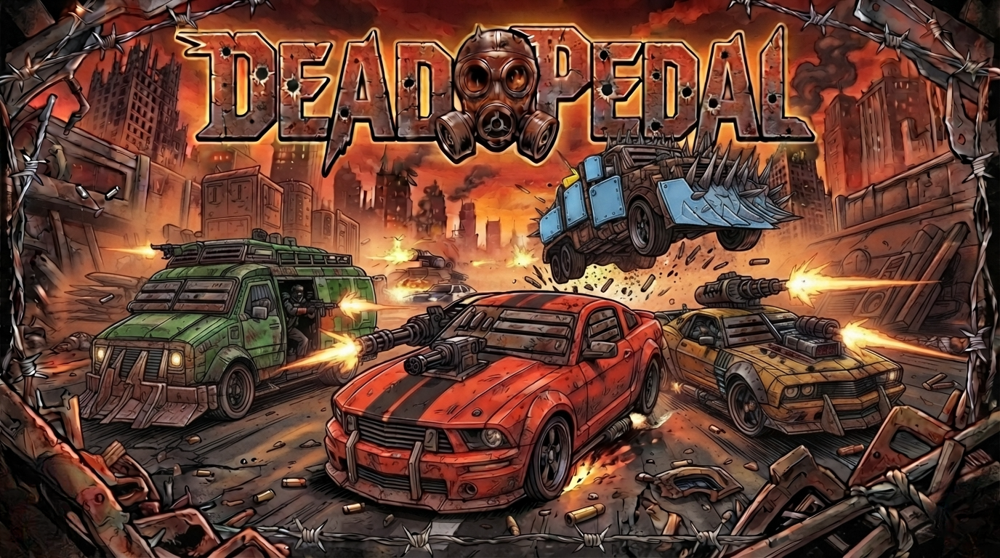

<p align="center">
  <a href="./LICENSE"></a>
  
  
  
  
  
</p>

<p align="center">
  
</p>

# Dead Pedal

A car combat game that runs in a browser. Four armoured cars, one dirt arena, five minutes, most
kills wins. TypeScript and three.js, no game engine and no physics library.

**▶ [Play it](#)** · *(not deployed yet — see [Running it](#running-it))*

---

## Read this first

I am not a game developer. This is the first time I have sat down and said "I am going to make a
video game," and I started it knowing two things: that I would lean on AI heavily, and that I would
almost certainly build a lot of it wrong.

That was the point. I wanted to push past the kind of project I normally build and see what happened.

So: **this is a toy, it is in beta, and I have no expectations for it.** It is not going to be the
next big thing and it is not trying to be. I am building it in public because building in public is
how I learn fastest, and because the mistakes are the interesting part.

I picked an existing, well-understood game mechanic on purpose — a car arena brawl — so that I would
be learning the *craft* rather than inventing a genre. Then I started as simple as I could: make a
car drive around, and make driving it feel good. Everything else came after that.

I have no idea what I am doing. I am curious, and I am asking a lot of questions.

## What I have actually learned

The part that surprised me most is how much of a game is **maths and tuning**, not code.

I expected to spend my time on rendering. Instead I have spent it on things like: how much steering
authority a car should keep as it approaches its top speed, what ratio of health to damage makes a
fight last the right number of seconds, how far apart two colours have to be before you stop
confusing them in your peripheral vision at speed, and how long a handbrake slide actually lasts
(1.05 to 3.70 seconds under player control, which is why the skid sound had to be a loop and not a
one-shot).

None of that is stuff I had ever been exposed to. Every number in this project came from measuring
something and then arguing with the result.

## Controls

| | |
|---|---|
| `W` `S` | throttle / brake |
| `A` `D` | steer |
| `Space` | handbrake |
| `J` / left click | machine gun |
| `K` / right click | special weapon |
| `L` | cycle special |
| `T` | next target *(homing missile only)* |
| `C` | look back |
| `P` | pause |
| `M` | cycle music |
| `N` | mute |
| `R` | reset |
| `E` | toggle engine audio implementation |

Gamepad works too: triggers to drive, left stick to steer, `A` handbrake, `X` gun, `Y` special,
`RB` cycle special, `LB` next target.

## Running it

```bash
npm install
npm run dev
```

Then open the URL it prints. There is no build step you need to care about and no server component
— it is a static site.

```bash
npm run check      # typecheck, lint, unit tests
npm run test:e2e   # Playwright, including a visual regression
npm run refsheet   # render reference sheets of every car
npm run botmatch   # run bot-vs-bot matches headlessly and print the results
```

## Where it is

48 of 55 tracked items are done. There is an interactive tracker in `tracker/`.

| | milestone | state |
|---|---|---|
| M0 | The harness — fixed timestep, seeded RNG, world hashing, replays | done |
| M1 | Driving feel — tyre model, slip, chase camera | done |
| M2 | Collision — SAT, chain-of-circles bodies, impulse resolution, the arena | done |
| M3 | Weapons — machine guns, rockets, mines, destruction and respawn | done |
| M4 | Lock-on, homing missiles, weapon crates | done |
| M5 | Bots — three difficulty tiers, as data | done |
| M6 | The match — timed deathmatch, scoring, HUD, radar, result board | done |
| M7 | Feel, art, audio — juice, sound, music, perf and visual guards | mostly |
| M8 | Multiplayer | not started |

What is left in M7 is the arena art pass. The cars have real models now; the arena is still boxes.

## How it is built

Some of this is probably over-engineered for a toy. I did it anyway, because doing it was the
point.

**The simulation is pure.** `src/core` and `src/sim` cannot import three.js, cannot touch the DOM,
and cannot read the clock. That is enforced two ways — an ESLint rule, and a second TypeScript pass
against a config with no DOM types at all — so it fails the build rather than drifting. It means the
whole game can run headlessly, which is how bot balance gets tested.

**It is deterministic.** Fixed 60Hz timestep, a seeded PRNG that lives inside the world state rather
than in a global, and a canonical-JSON hash of the world. The same seed and the same inputs produce
a byte-identical world, and there are replay fixtures asserting it. This is the thing I would keep
if I threw everything else away — nearly every hard bug in this project was found by noticing two
runs disagreed.

**The view is a projection, never a source of truth.** The renderer reads world state and draws it.
It never writes back. Sounds obvious; it is the rule I was most tempted to break, every time.

**The guards are calibrated against real regressions**, because a test that cannot fail is worse
than no test:

- A performance test asserts 8 vehicles step in under 2ms. It measures about 60µs, so the budget
  alone would never catch anything — the bound that actually works is the 4→8 vehicle scaling
  ratio, calibrated by injecting an O(n²) loop and checking it went red (clean 2.0x, regression
  3.9x, bounded at 3.0).
- A visual regression pins the clock frame by frame and compares the canvas against a committed
  baseline at 0.01% of pixels. That threshold was measured, not guessed: unchanged runs differ by
  0.000%, and the smallest real regression I could find differs by 0.036%.
- A draw-call budget of 100. It currently sits at 58. It was breached at 104–106 for a while
  without anyone noticing, because the number I had been reading excluded the shadow pass.

**A full 5-minute match runs headlessly in 365ms**, which is what makes it possible to tune bot
difficulty by simulating hundreds of matches instead of playing them.

## Known rough edges

- The arena is still untextured boxes. That is the next job.
- The player's car is the least beaten-up of the four, which is backwards for the tone.
- Round-scoped kill tracking and one match edge case are still open (see the tracker).
- No mobile support, no touch controls.
- Balance is tuned against bots, not people, because no people have played it.

## Assets and credits

The **cover art** was generated with Google's Gemini image model. It took several iterations, and
the thing that finally made it work was feeding it rendered turntables of the actual game models
(`npm run refsheet`) so the cars on the cover are the cars in the game — same silhouettes, same
liveries, same plough on the same pickup.

The **vehicle models** are from the Quaternius *Zombie Apocalypse Kit*, released CC0. They are
repainted at load time: the game rewrites the texture atlas per car so body, armour and trim are
coloured independently. See `src/view/carPaint.ts`.

**All sound effects and engine loops** were generated with ElevenLabs and conditioned for the game.
**Music** is three AI-generated tracks. No third-party audio ships here — see [CREDITS.md](CREDITS.md).

All game code is original.

## Other docs

- [ART.md](ART.md) — the art direction, and every image-generation prompt
- [SOUNDS.md](SOUNDS.md) — every sound the game makes and the prompt that made it
- [CREDITS.md](CREDITS.md) — asset provenance
- `tracker/` — an interactive milestone tracker
